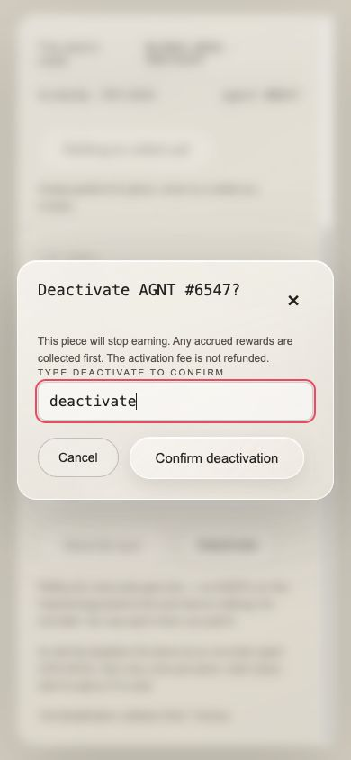

# AGNT deactivation confirmation

A ready-to-apply patch for `tuthouse/tut-pfp-drop` that prevents accidental NFT deactivation on the profile and activation gallery.

**Status:** implemented and tested locally; not deployed to mint.agnt.social. This is a patch handoff, not a runnable copy of the mint app.

## User experience

1. Click **Deactivate** to open a confirmation dialog naming the NFT.
2. Type the exact lowercase word **deactivate**.
3. Click **Confirm deactivation** to proceed.

Cancel, the close button, or Escape dismisses the dialog without submitting. Reopening clears the input, changing NFTs clears approval, and duplicate clicks cannot submit twice. The warning explains that earnings stop and the activation fee is not refunded.



## Apply the change

Download [deactivation-confirmation.patch](deactivation-confirmation.patch), then run these commands from a clean checkout of the original repository:

```sh
git switch -c fix/typed-deactivation-confirmation
git apply --check /path/to/deactivation-confirmation.patch
git apply /path/to/deactivation-confirmation.patch
```

The patch was built against commit `59ae92319c3c3196f075247720fe68a67e8c6599`. If the check fails on newer code, review and adapt the two-file diff before applying.

Changed files:

- `mint/components/PieceStage.tsx` — confirmation UI and submission guard shared by profile and gallery.
- `mint/tests/deactivation-confirmation.test.mjs` — seven regression tests.

Review, commit, and open a PR in the original repository. Transaction construction is unchanged. This handoff does not publish or deploy anything.

## Validation

- 7 new regression tests passed; all failed against the original behavior.
- 11 focused tests passed, including the existing activation-surface checks.
- TypeScript check and production build passed.
- Full Node suite: 365 passed, 38 failed, 5 skipped. The same 38 failures existed before this patch; no new failures were introduced.
- Chrome checks of the actual component in an offline fixture verified exact typing, cancellation, focus restoration, reset on reopening, and one callback after confirmation. Layout checked at 390 × 844.
- The packaged patch was applied separately to the original base file and its seven tests passed again.

Focused checks from `mint/`:

```sh
node --test tests/deactivation-confirmation.test.mjs tests/activate-surface.test.mjs
npx tsc --noEmit --incremental false
npm run build
```

The existing dependency lockfile required `npm ci --legacy-peer-deps --ignore-scripts --no-audit --no-fund` in the validation environment. No dependency files were changed.

## Sharing

This repository is private because the patch contains code from a private project. Invite the intended reviewer as a collaborator, then share this repository link. Access to the original repository is needed to apply and deploy the change.
